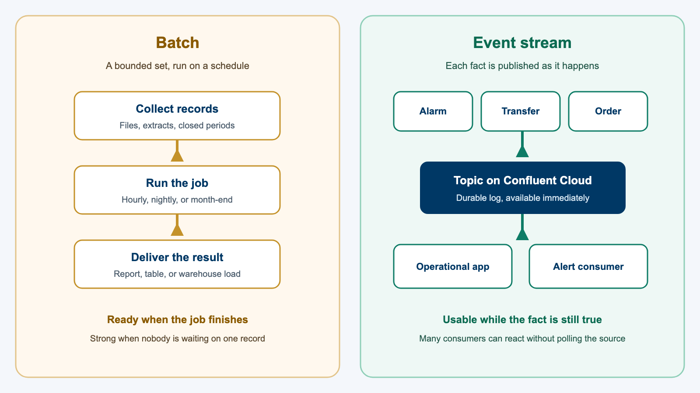
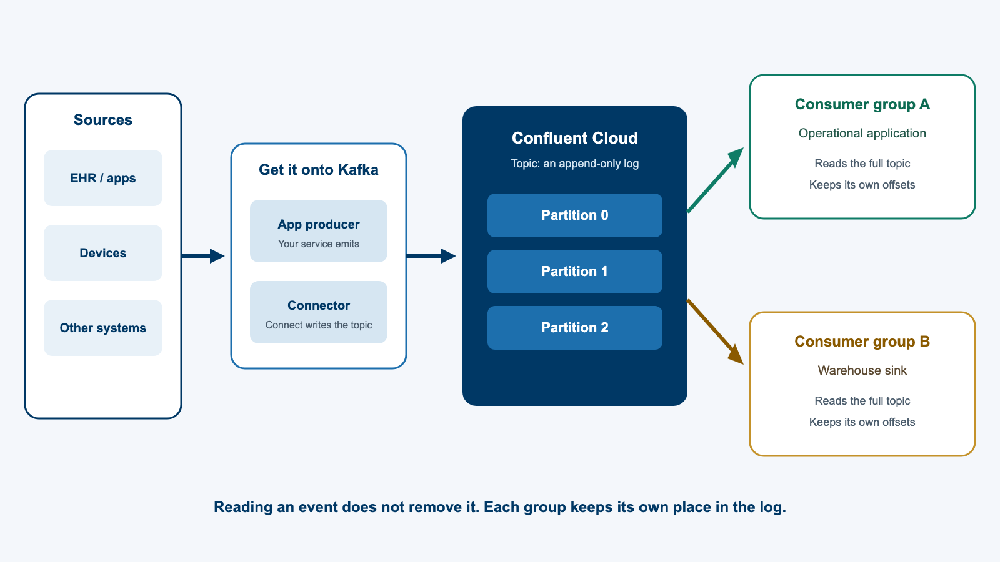
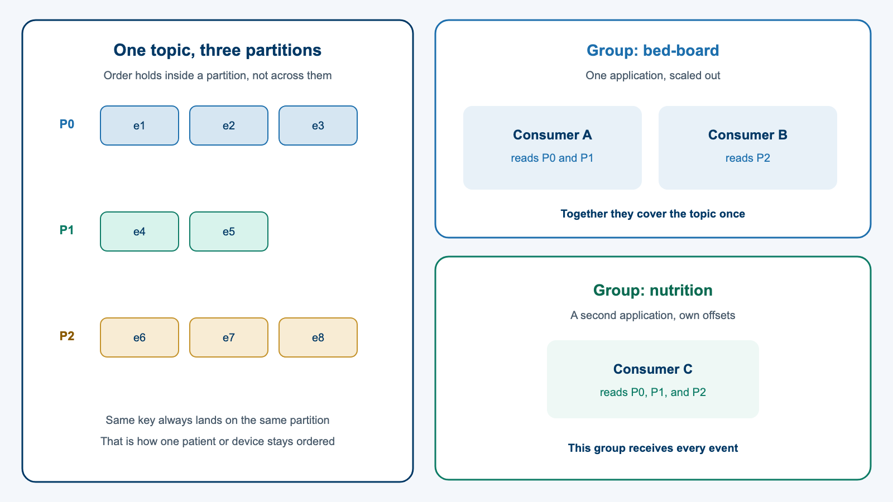
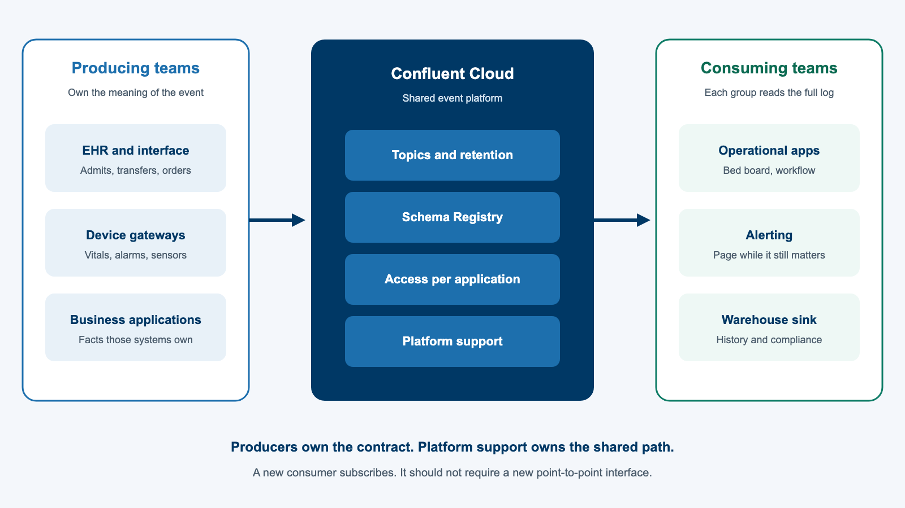

<!-- course-title: HCA: Real-Time Data Streaming with Kafka -->
<!-- layout: title -->


# Real-Time Data Streaming
# with Kafka and Confluent

## How events move from sources through Confluent Cloud to downstream applications

---

<!-- layout: panel-right -->
# Welcome!

- ROI leads the industry in designing and delivering customized technology and management training solutions
- Meet your instructor
  - Name
  - Background
  - Contact info
- Let’s get started!


---

# Course Objectives

- **Explain how real-time event data moves from sources through Kafka and Confluent Cloud to downstream applications**
- Decide when a stream is a better fit than a batch job
- Describe how producers, topics, and consumers move data through Kafka
- Map device data and application data onto an enterprise event platform

---

<!-- layout: panel-left -->
# Agenda

- Segment 1: Stream or Batch
- Segment 2: How Kafka Moves Data
- Segment 3: Low-Latency Event-Driven Design
- Questions and Answers


---

<!-- layout: panel-right -->
# Who Should Attend

- Teams that produce or consume data on Confluent Cloud today
- Teams that may adopt the platform for new integrations
- Platform engineers and support staff who run the streaming platform
- Architects choosing between batch jobs and event streaming


---

<!-- layout: panel-left -->
# Prerequisites

- Comfort with applications, databases, and file-based data exchange
- Familiarity with cloud-hosted shared platforms
- Helpful: exposure to integration, ETL, or messaging
- No prior Kafka administration experience required


---

<!-- layout: navigation -->
# Course Roadmap

- **Stream or Batch**
- How Kafka Moves Data
- Low-Latency Event-Driven Design

---

# Streaming Means Events

- **This session is data and event streaming on Kafka, not audio or video**
- A stream is an unbounded sequence of facts: a transfer, a vital sign, an order, an alarm
- A producer appends each fact to a topic; consumers read that log and act
- Confluent Cloud is the managed Kafka platform those teams share

> [!NOTE]
> “Near real time” means a consumer can act in seconds, while the situation is still true. It is not a video latency target and it is not high-frequency trading.

---

<!-- layout: title-image -->
# Batch and Stream Side by Side



---

<!-- layout: 2-column -->
# What Each One Optimizes For

### Batch
- Bounded input and a scheduled job
- High throughput over a complete set
- Strong fit for closed periods and rebuilds
- The result arrives when the job finishes

### Stream
- Unbounded events, handled continuously
- Freshness measured in seconds
- Many consumers can share one fact
- You take on schema, lag, and retries

<!-- below-columns -->

> [!TIP]
> Pick from the consumer’s deadline. If nobody acts until morning, a nightly job is not a failure of streaming.

---

<!-- layout: card-layout -->
# Three Questions Before You Choose

### How fresh?
- If the answer can wait for a schedule, batch is enough.
- If the answer expires in minutes, publish an event.

### Who is waiting?
- Someone or some system must be ready to consume continuously.
- A topic nobody reads is not a real-time design.

### What stays the source of truth?
- Kafka moves the change. It does not replace the EHR, the device, or the warehouse.
- Keep the system of record, and stream the fact that it changed.

---

<!-- layout: 2-column -->
# Two Questions, Two Designs

### Page someone now
- A pump or monitor crosses a threshold
- The fact is stale within minutes
- A gateway publishes an alarm event
- A consumer pages the responding team

### Explain it next week
- Leadership wants last week’s volumes
- The dataset is bounded and complete
- A warehouse job is the right shape
- A topic would add cost and no waiting consumer

---

<!-- layout: 3-column -->
# Where the Work Belongs

### Choose a stream
**Live alarm**
- Someone must act now
- A morning file is already late
- Publish the event as it happens

### Stay with batch
**Leadership pack**
- The period is already closed
- Completeness beats speed
- Schedule the warehouse job

### Not a topic
**Point lookup**
- “What room is this patient in?” can stay a request
- Do not stream a fact nobody consumes
- An unread topic is just storage

---

# The Warehouse Still Matters

- **Streaming a fact does not retire the batch path that explains history**
- Operational consumers need the event now; analysts often need a complete table later
- A sink can land the same topic in the warehouse without a second extract from the source
- Batch remains the right tool for rebuilds, reconciliations, and closed reporting periods

> [!WARNING]
> Do not rip out a working batch job because a platform exists. Add a stream where a consumer is actually waiting.

---

<!-- layout: navigation -->
# Course Roadmap

- Stream or Batch
- **How Kafka Moves Data**
- Low-Latency Event-Driven Design

---

<!-- layout: title-image -->
# From Source to Downstream System



---

<!-- layout: 2-column -->
# Two Ways to Produce

### Your application produces
- The service knows the business moment
- It chooses the key and the event type
- Use this for facts your system owns
- Example: the app emits OrderPlaced

### A connector produces
- Managed Connect writes for a system that should not embed a Kafka client
- Typical for databases, SaaS, or a gateway feed
- The connector still lands records on a topic
- Example: device readings bridged onto a topic

<!-- below-columns -->

> [!NOTE]
> Clinical systems often reach Kafka through an interface engine. That engine is the producer, even when the EHR remains the system of record.

---

<!-- layout: 2-column -->
# Anatomy of a Transfer Event

### Why each field is there
- `event_type` tells consumers what happened
- `event_time` is when the transfer happened
- `patient_id` is the ordering key
- The units are the fact other systems need

### Illustrative payload
```json
{
  "event_type": "PatientTransferred",
  "event_time": "2026-09-25T14:03:11Z",
  "patient_id": "p-18422",
  "from_unit": "4E",
  "to_unit": "ICU"
}
```

<!-- below-columns -->

> [!IMPORTANT]
> Put the business time in the payload. The time Kafka stored the record is not the time the patient moved.

---

# A Producer Writes a Record

- **A successful produce appends the record and returns an acknowledgement**
- The key keeps one patient, device, or order on a single partition
- The value is the fact, described by a schema consumers can rely on
- Until the acknowledgement returns, downstream systems have not seen the event

```python
producer.produce(
    topic="adt.patient-events",
    key=patient_id,
    value=event_json,
)
producer.flush()
```

---

<!-- layout: 3-column -->
# Topic, Partition, Offset

### Topic
- Named log of one kind of fact
- Example: `adt.patient-events`
- Many groups can read it
- Retention is set on the topic

### Partition
- Ordered shard of that log
- Order holds inside one partition
- The key chooses the partition
- More partitions, more parallel readers

### Offset
- Position in one partition
- Stored per consumer group
- Commit means “handled”
- Replay starts further back

---

<!-- layout: title-image -->
# One Topic, Two Kinds of Readers



---

# A Consumer Reads and Commits

- **Poll, handle, then commit: that is the consumer’s contract with the group**
- Two instances of one application share a group id and split the partitions
- Two applications that both need every event use two group ids
- Extra consumers beyond the partition count sit idle; they do not add throughput

```python
consumer.subscribe(["adt.patient-events"])
msg = consumer.poll(1.0)
handle(msg.key(), msg.value())
consumer.commit(msg)
```

> [!WARNING]
> A shared group id splits the stream. It does not give each application a full copy. Commit only after a successful handle, and make a second delivery safe.

---

<!-- layout: card-layout -->
# How a Healthy Topic Goes Wrong

### Consumer lag
- The group is behind the log, so alarms and bed boards are stale.
- Scale only up to the partition count. More consumers than partitions sit idle.

### Duplicates
- A producer can deduplicate its own retries. A crash before commit cannot.
- Apply the transfer by key so handling it twice does not invent a second move.

### A bad record
- One poison payload can stall every later event on that partition.
- Route the failure aside. Do not hold every patient behind one bad record.

---

# The Log Keeps the Fact

- **A consumer does not delete an event by reading it**
- Kafka retains the topic for a configured time, then drops older records
- A new group can replay whatever is still inside that window
- Long compliance history belongs in the warehouse sink, not in an endless hot topic

> [!IMPORTANT]
> If an alarm consumer is offline longer than retention, those events are gone. Set retention for the outage you still intend to recover by replay.

---

<!-- layout: navigation -->
# Course Roadmap

- Stream or Batch
- How Kafka Moves Data
- **Low-Latency Event-Driven Design**

---

<!-- layout: 2-column -->
# Ask, or Publish the Fact

### Request and response
- The caller asks a source and waits
- Every new consumer adds load and a private interface
- Fine for “what is true this instant”
- Poor when many systems must learn that something changed

### Event-driven
- The source publishes the fact once
- A new consumer subscribes without changing the source
- The log retains the fact so a group can replay
- You now own the schema, the key, and the lag

<!-- below-columns -->

> [!NOTE]
> An event announces a fact. It is not a command to every downstream system. Each consumer decides what to do with PatientTransferred.

---

<!-- layout: title-image -->
# A Shared Platform, Many Teams



---

# Where the Seconds Go

- **Broker time is rarely the latency people feel**
- The budget runs from the source event to a person or system acting
- Kafka usually makes an acknowledged record readable in milliseconds
- The rest sits in the gateway, the consumer, or a stream processor such as Flink

| Step | What usually happens | What stretches it |
| :--- | :--- | :--- |
| Source | The device or app notices | Gateway buffering, interface-engine batching |
| Produce | The client waits for an ack | Silent retries, a client that never checks the error |
| On the topic | The record is readable | Still usually milliseconds after a successful ack |
| Consume and act | The group handles it | Lag, rare polling, a slow database write |

> [!TIP]
> When an alarm is late, check consumer lag and the gateway interval before you blame the cluster.

---

<!-- layout: 2-column -->
# Device Data and Application Data

### Device and sensor data
- Monitors, pumps, fridges, location badges
- The device usually does not speak Kafka
- A gateway or integration service produces
- Often high rate: thresholds, or the latest value

### Application and system data
- EHR, scheduling, orders, internal applications
- The system of record emits a business fact
- Lower rate, richer payload, clearer event types
- Example: admit, discharge, and transfer (ADT)

<!-- below-columns -->

> [!NOTE]
> Both shapes use the same topic, key, group, and offset model. The producer in front of the device is what changes.

---

<!-- layout: 3-column -->
# Three Uses of the Same Platform

### Device alarm
**Fridge excursion**
- Gateway publishes the reading
- Alert group pages pharmacy
- Latest value matters more than a full history on the topic

### Clinical fact
**Patient transfer**
- Interface engine produces
- Key is the patient or encounter
- Bed board and nutrition each have a group

### System event
**Order or app fact**
- The owning application produces
- Other systems subscribe instead of polling
- Schema Registry holds the contract

---

<!-- layout: 2-column -->
# Who Owns What

### Producing and consuming teams
- Define the event and its schema
- Choose the key and the topic
- Write the producer, or request a connector
- Make the consumer safe to run twice
- Own the business response

### Platform support
- Environments, access, and quotas on Confluent Cloud
- Schema compatibility rules
- Retention, storage, and the network path
- Lag, failures, and who gets called
- Least privilege for every application

<!-- below-columns -->

> [!IMPORTANT]
> Platform support keeps the path healthy. They do not decide what PatientTransferred means. That stays with the producing team.

---

<!-- layout: card-layout -->
# Before a Team Goes Live

### Schema
- Register the contract before another team depends on the payload.
- Add fields safely. Renaming or dropping a field is a breaking change.

### Access
- Grant each application only the topics it produces or consumes.
- Clients authenticate to Confluent Cloud. Anonymous produce and consume is not the model.

### Retention and PHI
- Keep the hot topic only as long as replay still matters.
- Payloads may be protected health information. Treat the topic as governed data.

### Lag
- Name an owner for consumer lag on any path that pages a person.
- A quiet consumer may be down, not idle.

---

<!-- layout: 3-column -->
# Stream, Batch, or Both

### Stream
**Fridge excursion**
- Actionable only while it is happening
- Gateway publishes, an alert group pages
- A nightly extract misses the excursion

### Batch
**Monthly utilization**
- The question is a closed month
- A warehouse job is enough
- Nobody is waiting on one event

### Both
**Patient transfer**
- Operations need the bed update in seconds
- Compliance still wants warehouse history
- Stream the event, and sink it for the report

<!-- below-columns -->

> [!WARNING]
> “Real time” is not a reason to put every interface on Kafka. Name the waiting consumer, or keep the batch job.

---

# What You Learned

- Explained how real-time event data moves from sources through Kafka and Confluent Cloud to downstream applications
- Decided when a stream is a better fit than a batch job
- Described how producers, topics, and consumers move data through Kafka
- Mapped device data and application data onto an enterprise event platform

---

# Quiz 1 of 3

**A unit needs the current bed assignment within a minute of a transfer. Today that fact arrives in a nightly file. What is the better fit?**

- A. Keep the nightly file and ask the unit to wait until morning
- B. Publish a transfer event as it happens so consumers can update while the assignment is current
- C. Replace the EHR database with a Kafka topic
- D. Have every downstream system poll the EHR on its own nightly schedule

---

# Quiz 1: Answer

**A unit needs the current bed assignment within a minute of a transfer. Today that fact arrives in a nightly file. What is the better fit?**

**Correct: B.** Publish a transfer event as it happens so consumers can update while the assignment is current

- The assignment is already wrong by morning, so the batch deadline misses the consumer
- Kafka carries the change; the EHR stays the system of record
- A separate nightly poll from every consumer adds load and coupling
- The same event can still sink into the warehouse for history

---

# Quiz 2 of 3

**Bed management and nutrition both must react to every patient transfer. How should they read the topic?**

- A. Share one consumer group so Kafka splits events between the two applications
- B. Use two consumer groups so each application gets the full stream and its own offsets
- C. Let one application consume and email the other a spreadsheet
- D. Use the same group id and expect each application to see every partition

---

# Quiz 2: Answer

**Bed management and nutrition both must react to every patient transfer. How should they read the topic?**

**Correct: B.** Use two consumer groups so each application gets the full stream and its own offsets

- Inside one group, each record is delivered to only one member
- A second group is how a second application gets its own copy and its own place in the log
- Sharing a group id is how you scale one application, not how you integrate two
- One group can lag or fail without stopping the other group’s offsets

---

<!-- layout: 2-column -->
# Quiz 3 of 3: Discussion

### Prompt
A device gateway can publish fridge temperatures. The EHR can publish admission events. Clinical engineering wants live alarms. Compliance still needs 90 days of history in the warehouse.

### Discuss
- Which facts should be events, and which can stay on a batch path?
- Who produces, and which consumer groups do you create?
- What must be true before either team goes live on the shared platform?

---

<!-- layout: 2-column -->
# Quiz 3: Discussion Points

**A device gateway can publish fridge temperatures. The EHR can publish admission events. Clinical engineering wants live alarms. Compliance still needs 90 days of history in the warehouse.**

### Strong Answers Mention
- Alarms are a stream; the 90-day report is a sink into the warehouse
- The gateway produces device events; the EHR or interface engine produces admissions
- Separate topics, and separate groups for alarming and for the warehouse
- A key so one fridge or one patient stays ordered
- Schema, access, retention, and PHI handling agreed before go-live
- An owner for consumer lag on the alarm path

### Watch For
- One shared consumer group for unrelated applications
- Treating Kafka as a system of record that replaces the EHR
- Putting broad PHI on a widely readable topic because it is internal
- Assuming broker latency is the end-to-end latency the nurse will feel

---

<!-- layout: stacked -->
# Questions and Answers


